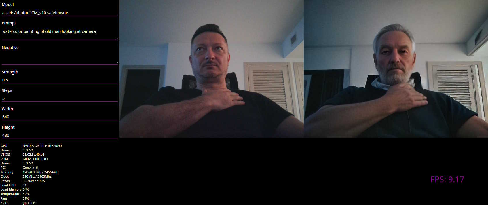

# Fast WebCam and Video processing using Stable Diffusion

Optimizations:

- Pre-computed prompt embeds (computed on prompt change, not on each generate)
- LCM scheduler (should use SD15 LCM model)
- TAESD VAE decode
- Separate queues and threads for receive/process/decode/upload
- Optional StableFast
- Optional DeepCache
- Optional Torch compile

## Result

Without too many optimizations (more to come) its already running at ~10 FPS using nVidia RTX4090 at 640x480 resolution  



## Overview

Communication:

- All communication between browser and backend is done using raw websockets real-time

Processing:

- Server maintains two buffers, each n frames deep  
- Frames are received from client and stored in buffer until its full and then it switches the buffer  
  Backend throttles the client to match buffers in full state by sending ready-to-receive messages  
- When buffer is full it is processed by the model as a batch job in a separate thread  
- When processing is done, it stores data in decode queue so it can immediately start processing next buffer  
- VAE decodes all data in decode queue and places it in send queue  
- Server sends any data in output buffer to client asynchronously  

Client:

- Attempts to maintain constant frame rate based on forward-adjusted server latency  

## Run

- edit `src/options.py` for default options
- start using `accelerate launch src/main.py` or `python src/main.py`

```log
15:07:29-504314 INFO     /home/vlado/dev/sd-fastvideo/src/main.py
15:07:29-506185 DEBUG    env setup
15:07:29-506786 INFO     packages: torch=2.2.0+cu121 diffusers=0.26.3
15:07:29-507657 INFO     options: {'device': 'cuda', 'dtype': 'torch.float16', 'batch': 8, 'model': 'assets/photonLCM_v10.safetensors', 'prompt': 'watercolor painting of old man looking at camera', 'negative': '', 'strength': 0.5, 'steps': 5, 'cfg': 0.0, 'deepcache': False, 'stablefast': False, 'inductor': False}
15:07:29-508541 DEBUG    fastapi args: {...}
15:07:29-510256 DEBUG    init middleware
15:07:29-511226 DEBUG    uvicorn args: {..}
15:07:29-513875 INFO     uvicorn start: http://127.0.0.1:8000
15:07:29-621352 INFO     gpu: {'name': 'NVIDIA GeForce RTX 4090', 'version': {'cuda': 12040, 'driver': '551.52', 'vbios': '95.02.3c.40.b8', 'rom': 'G002.0000.00.03', 'capabilities': (8, 9)}, 'pci': {'link': 4, 'width': 16, 'busid': '00000000:01:00.0', 'deviceid': 646189278}, 'memory': {'total': 24564.0, 'free': 22090.35, 'used': 2473.65},
                         'clock': {'gpu': [210, 3165], 'sm': [210, 3165], 'memory': [405, 10501]}, 'load': {'gpu': 1, 'memory': 35, 'temp': 49, 'fan': 0}, 'power': [30.96, 405.0], 'state': 'gpu idle'}
15:07:29-622601 INFO     loading: model="assets/photonLCM_v10.safetensors" options={...}}
15:07:33-198810 INFO     loaded: model="assets/photonLCM_v10.safetensors" class=StableDiffusionImg2ImgPipeline sampler=LCMScheduler device=cuda time=3.576
15:07:44-384946 INFO     warmup: model="assets/photonLCM_v10.safetensors" time=11.186
15:07:44-385690 INFO     ready...
15:07:50-387542 DEBUG    server: alive=True requests=0 uptime=21 clients=0 frames=0 queue=0/0
15:09:11-416624 INFO     http user=None code=302 http/1.1 GET / 127.0.0.1 0.0004
15:09:11-778678 DEBUG    ws connect: client=127.0.0.1 agent="Mozilla/5.0 (Windows NT 10.0; Win64; x64) AppleWebKit/537.36 (KHTML, like Gecko) Chrome/122.0.0.0 Safari/537.36 Edg/122.0.0.0"
15:09:15-088734 INFO     vae load
15:09:15-635224 INFO     process: time=0.546 images=8 its=36.614 used=4.91 total=23.99
```

## TODO

- improve requirements.txt
- dynamic optimizations
- json config
- manual init_latents
- ui
- video processing
